# Javatro User Guide

**Javatro** is a command-line card game inspired by **Balatro**. 
It is designed to be played via a _Command Line Interface (CLI)_ and features multiple deck options, unique scoring mechanisms, and strategic gameplay. 
This guide explains the features, commands, and game flow to help you master Javatro.

---

## Table of Contents

- [1. Introduction](#introduction)
- [2. Quick Start](#quick-start)
- [3. Features](#features)
    - [3.1 Main Menu](#main-menu)
    - [3.2 Selecting a Deck](#selecting-a-deck)
    - [3.3 Choosing a Blind](#choosing-a-blind)
    - [3.4 Game Interface](#game-interface)
    - [3.5 Playing Cards](#playing-cards)
    - [3.6 Discarding Cards](#discarding-cards)
    - [3.7 Viewing the Deck](#viewing-the-deck)
    - [3.8 Viewing Poker Hands](#viewing-poker-hands)
    - [3.9 Winning a Small / Large Blind](#winning-a-small--large-blind)
    - [3.10 Winning a Boss Blind](#winning-a-boss-blind)
    - [3.11 Help Menu](#help-menu)
    - [3.12 Saving / Loading a Game](#saving--loading-a-game)
- [4. Gameplay Flow](#gameplay-flow)
- [5. Tips for New Players](#tips-for-new-players)
- [6. FAQs](#faqs)
- [7. Known Issues](#known-issues)
    - [7.1 Terminal Window Behaviour](#terminal-window-behavior)
- [8. Glossary](#glossary)
- [9. Acknowledgements](#acknowledgements)

---

## Introduction

**Javatro** is a strategic card game combining poker mechanics with roguelike elements. 
Build high-scoring poker hands, leverage unique deck abilities, and defeat challenging blinds to progress through rounds.

The _objective_ of the game is to score the highest points by creating valid poker hands from the cards dealt. 
It adds a layer of complexity with various deck types and special mechanics, making it a unique experience.

---

## Quick Start

Before you begin, ensure you have **Java 17** installed.  
_Javatro has **audio** implemented. Turn up your volume for the best experience!_

1. **Installation:**
    - Download the `javatro.jar` file from the [latest release](https://github.com/AY2425S2-CS2113-W13-1/tp/releases/tag/release-v2.1) of Javatro.
    - Open your preferred terminal in Fullscreen.
    - Run the game using one of these commands:
      ```bash
      java -Dfile.encoding=UTF-8 -jar javatro.jar
      java "-Dfile.encoding=UTF-8" -jar javatro.jar
      ```
2. **Navigation:**
    - Use on-screen numbered options to navigate.
    - For example, enter `1` to start a new game or `4` to exit in the main menu.

*Tip:* If you enter an invalid command, Javatro will display an informative error message.

*Note:* If you change your terminal window size when using the program, there may be UI errors. 
See: [Terminal Window Behaviour](#terminal-window-behavior)

---

## Features

_This section details the various screens and features available in Javatro._

### Main Menu
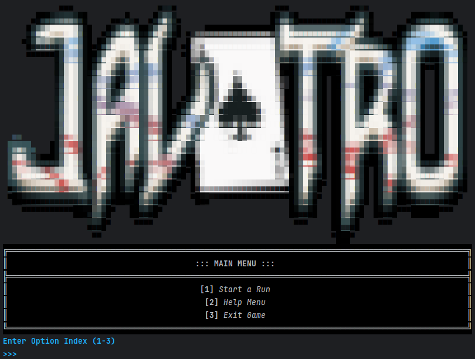

Players will be shown the **Javatro Main Menu** whenever they boot up the game or select `Main Menu`.  
_Javatro Music Theme will begin playing._

#### Menu Options:
- `1. Start a Run`
- `2. Help Menu`
- `3. Exit Game`

_Enter `1` to continue an existing run or start a new one.  
Enter `2` to see helpful information about Javatro.   
Enter `3` to exit the game._

---

### Selecting a Run
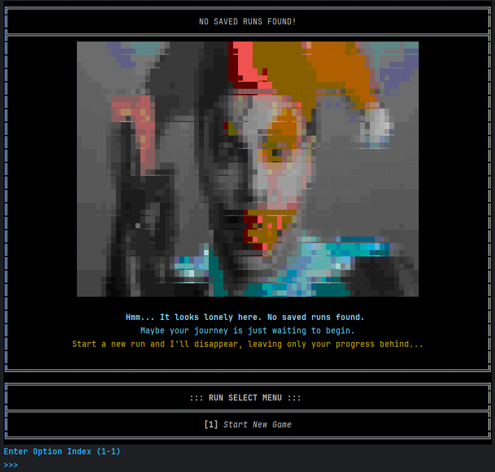

When launching Javatro for the _first time_, if **no saved game runs exist**, 
players will be prompted to _start a new game run_ immediately.

If the player has _existing saved runs_, the game will take you to the **Run Select Menu**, 
where they can manage and continue their game progress. 

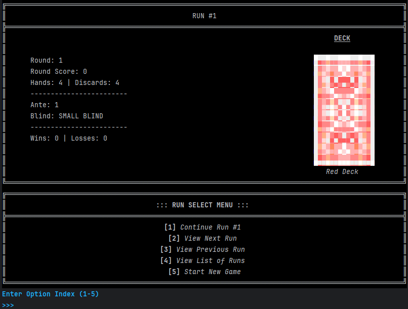

The **Run Select Menu** shows information about the _currently selected run_. 
Players can browse through their saved runs using the available navigation options.

#### Information Provided:
- Round count _(how many rounds have been played)_
- Total score accumulated 
- Remaining hands and discards 
- Current ante count 
- Type of blind 
- Wins/Losses recorded in this run 
- Deck type used in the run

#### Menu Options:

- `1. Continue Run #X`
- `2. View Next Run`
- `3. View Previous Run`
- `4. View List of Runs`
- `5. Start New Game`

_Enter `1` to continue the currently displayed run.  
Enter `2` to view the next run in the saved run list.   
Enter `3` to view the previous run.  
Enter `4` to view the full list of saved runs.  
Enter `5` to start a new game run._


If the player has multiple saved runs, selecting the `View List of Runs` option will display the **entire list** of saved runs.
Players can then select a **specific run** to _inspect or continue_, avoiding the need to click through runs one-by-one.  
_This feature is especially helpful for players managing many game sessions._

---

### Selecting a Deck

 
After selecting `Start New Game`, players will be prompted to choose from various decks to use at the start of every run.
**Decks** contain playing cards that are key to forming poker hands. 
_Each deck has different effects with unique rules or bonuses._

#### Menu Options:
| Deck                | Effect                                                       |
|---------------------|--------------------------------------------------------------|
| `1. Red Deck`       | Grants the player one additional **discard** per round       |
| `2. Blue Deck`      | Grants the player one additional **hand** per round          |
| `3. Checkered Deck` | Starts with 26 **Hearts** and 26 **Spades**                  |
| `4. Abandoned Deck` | Removes all **face** cards (King, Queen, Jack) from the deck |

_Enter `1`, `2`, `3` or `4` to select your deck._

---

### Choosing a Blind
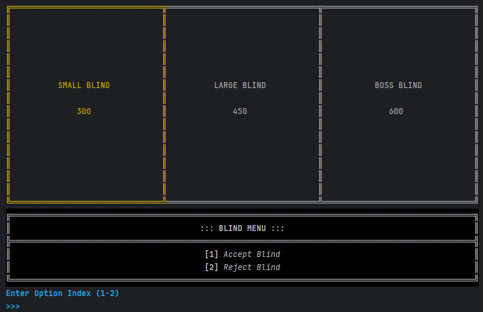

After selecting a deck, players are prompted to select a **Blind**.
Blinds are the main obstacle that the player must overcome in Javatro. 
For each round, the player has to get enough score to beat the Blind, losing the game otherwise. 
_Defeating the Blind will award the player with rewards._

An **Ante** is made up of three Blinds in succession: a Small Blind, a Large Blind, and a random Boss Blind. 
The Small and Big Blinds are optional in the gameplay.  
_However the Boss Blind must always be played and cannot be skipped._

The score required by a certain Blind is determined by the Ante level. 
Players start at Ante 1 and go up a level for every Boss Blind defeated, 
and can win the game by beating the last level of a run, at Ante 8.

#### Information Provided:
| Blind Type  | Target Score                     |
|-------------|----------------------------------|
| Small Blind | A **low** score requirement      |
| Large Blind | A **moderate** score requirement |
| Boss Blind  | A **high** score requirement     |

#### Menu Options:
- `1. Accept Blind`
- `2. Reject Blind`

_Enter `1` to accept the current blind and proceed to the game, 
or `2` to reject the current blind and progress to the next one._

---

### Game Interface
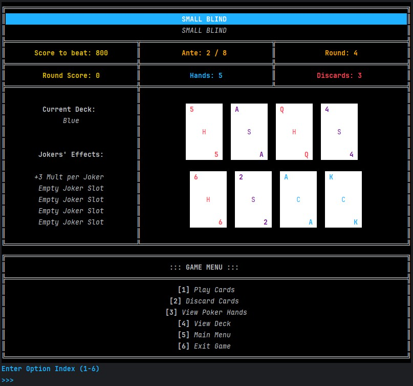

After selecting `Accept Blind` or `Continue Run`, players will be shown the main **Javatro game interface** and dealt cards at the start of each round.

To **defeat a blind**, the player must select cards from their hand to play poker hands and score chips. 
_A given number of discards are available to assist with creating better hands._

Upon reaching the score requirement, the round ends and the player receives rewards.

#### Information Provided:

| Blind Information                                          |
|------------------------------------------------------------|
| Blind Name _(Boss Blinds will have unique names)_          |
| Blind Description _(Boss Blinds will have unique effects)_ |

| Score Information                     | Round Information                    | Gameplay Information                   |
|---------------------------------------|--------------------------------------|----------------------------------------|
| Score required to <br/> win the blind | Current Ante count                   | Current Round count                    |
| Total score earned <br/>in this round | Number of Hands<br/> player has left | Number of Discards<br/>player has left |

| Passive Information          | Holding Hand                      |
|------------------------------|-----------------------------------|
| Name of Deck in use          | Cards that are available for play |
| List of active Joker effects | Cards that are available for play |

#### Menu Options:
- `1. Play Cards`
- `2. Discard Cards`
- `3. View Poker Hands`
- `4. View Deck`
- `5. Main Menu`
- `6. Exit Game`

_Enter a number from `1` to `6` to make a gameplay action._

---

### Playing Cards

**_Sorted by Suit_**  
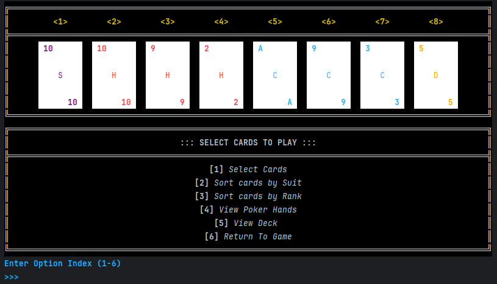

After selecting `Play Cards`, the player is directed to the **Play Cards Menu**.  
Players are able to _select_ and _play_ cards to form valid poker hands. 
**Sorting options** are also provided to help arrange cards effectively before making a selection.

#### Menu Options:
- `1. Select Cards` - Choose cards you wish to **play** from your current hand.
- `2. Sort cards by Suit` - Rearranges your cards based on their **suit** _(Spades, Hearts, Clubs, Diamonds)_.
- `3. Sort cards by Rank` - Rearranges your cards based on their **rank** _(Ace, King, ..., 3, 2)._
- `4. View Poker Hands` - Display possible **poker hands** you can form with your current cards.
- `5. View Deck` - Shows all the remaining cards in the **deck**.
- `6. Return To Game` - Go back to the **main game interface** without making any changes.

_Enter a number from `1` to `6` to make a gameplay action._

After selecting `1. Select Cards`, the player will be prompted to input the indices of the cards they wish to play.  
_The player will no longer be able to return to the game interface at this point!_  
_The input indices have to be comma-separated (as shown below)._


After entering the card indices, the game will show the **cards** the player has chosen to play, 
as well as the **poker hand** that has been formed.

---

### Discarding Cards

**_Sorted by Rank_**  
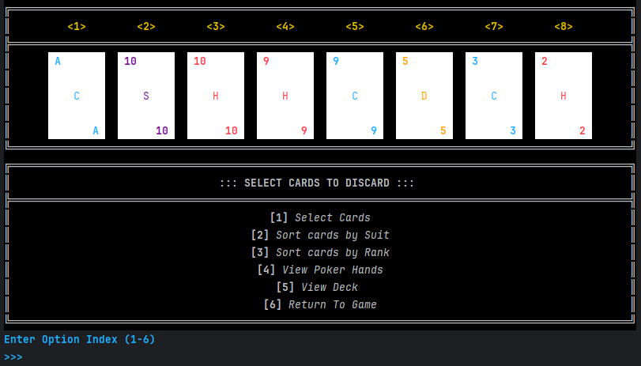  

After selecting `Discard Cards`, the player is directed to the **Discard Cards Menu**.  
Player can _strategize_ and make preparations by _discarding_ unwanted cards, 
allowing them to possibly form better poker hands by _redrawing_ new cards.

#### Menu Options:
- `1. Select Cards` - Choose cards you wish to **discard** from your current hand.
- `2. Sort cards by Suit` - Rearranges your cards based on their **suit** _(Spades, Hearts, Clubs, Diamonds)_.
- `3. Sort cards by Rank` - Rearranges your cards based on their **rank** _(Ace, King, ..., 3, 2)._
- `4. View Poker Hands` - Display possible **poker hands** you can form with your current cards.
- `5. View Deck` - Shows all the remaining cards in the **deck**.
- `6. Return To Game` - Go back to the **main game interface** without making any changes.

_Enter a number from `1` to `6` to make a gameplay action._

After selecting `1. Select Cards`, the player will be prompted to input the indices of the cards they wish to discard.
_The player will no longer be able to return to the game interface at this point!_  
_The input indices have to be comma-separated (as shown below)._


After entering the card indices, the game will show the **cards** the player has chosen to discard.

---

### Viewing the Deck
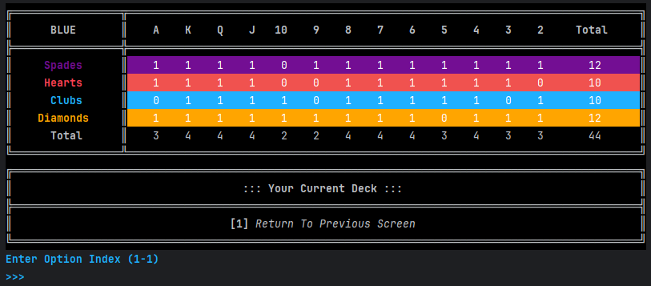

After selecting `View Deck`, players are directed to the **Deck Viewer**, displaying the composition of the current deck. 
It shows the distribution of cards across _suits_ and _ranks_, helping to keep track which cards remain available.

#### Information Provided:
- **Deck Type**: Displayed on the top left.
- **Suits**: Spades, Hearts, Clubs, Diamonds listed _row-wise_.
- **Ranks**: A, K, Q, J, 10, ..., 2 listed _column-wise_.
- **Total Count**: Shows how many **cards** of each rank and suit remain.

_Enter `1` to go back to the previous screen._

---

### Viewing Poker Hands
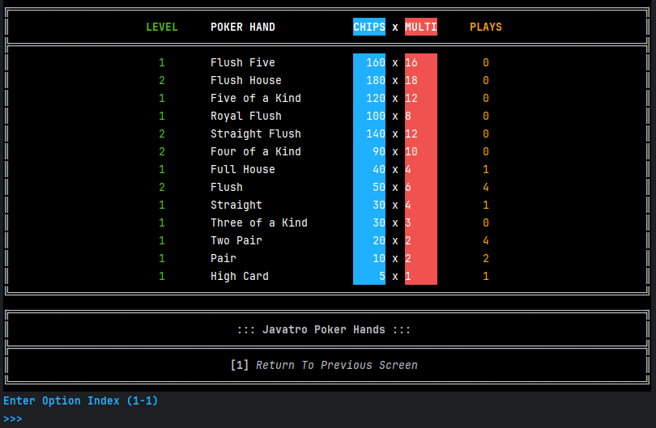

After selecting `View Poker Hands`, players are directed to the **Poker Hand List**, which shows all the possible _poker hands_, 
allowing the player to easily see different statistics to help them plan and optimise.  

**Poker Hands** are sets of between one and five cards that can be played in Javatro to obtain _Chips_ and _Multi_ for scoring.
Each hand also has a **level** that affects its potency.
In a run, all Hands start at Level 1, and are upgraded through **Planet cards**.

Higher tier hands _take precedence_ over lower tier hands regardless of their level or scoring.  
**E.g.** if your played hand is K K K K 2, and all of them are diamonds, the hand will always be a _Four of a Kind_ and never a _Flush_.

#### Information Provided:
- **Level**: The amount of **extra stats** given to a hand _(Incremented through Planet Cards)._
- **Poker Hands**: Listed in _descending order_ of value.
- **Chips**: The _base chip value_ awarded for completing a hand.
- **Multiplier (MULTI)**: The _multiplier_ applied to chips for enhanced rewards.
- **Plays**: The _number of times_ a hand has been successfully played.

_Enter `1` to go back to the previous screen._

#### Poker Hand Descriptions:

| Poker Hand          | Condition                                                                                                                    |
|---------------------|------------------------------------------------------------------------------------------------------------------------------|
| **High Card**       | When no other hand is possible, the one highest card in your hand. Aces are counted high for this hand.                      |
| **Pair**            | Two cards with a matching rank. Suits may differ.                                                                            |
| **Two Pair**        | Two cards with a matching rank, and two cards with any other matching rank. Suits may differ.                                |
| **Three of a Kind** | Three cards with a matching rank. Suits may differ.                                                                          |
| **Straight**        | Five cards in consecutive order which are not all from the same suit. Aces can be counted high or low, but not both at once. |
| **Flush**           | Five cards of any rank, all from a single suit.                                                                              |
| **Full House**      | Three cards with a matching rank, and two cards with any other matching rank, with cards from two or more suits.             |
| **Four of a Kind**  | Four cards with a matching rank. Suits may differ.                                                                           |
| **Straight Flush**  | Five cards in consecutive order, all from a single suit.                                                                     |
| **Royal Flush**     | An ace-high Straight Flush formed by playing A K Q J 10 of the same suit.                                                    |

---

### Winning a Small / Large Blind
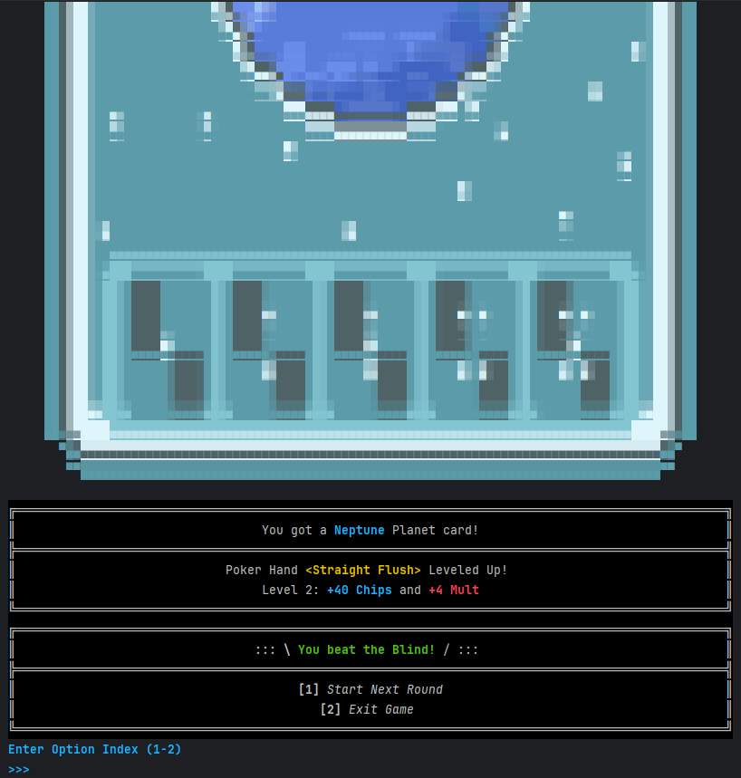

**Small and Large Blinds** have no other effects and can be _skipped_.  
The score required is _1x base chips_ for **Small Blind**, and _1.5x base chips_ for **Large Blind**.  
After completing a Small or Large blind successfully, players will _randomly_ receive one of the 12 available **Planet Cards**. 

**Planet Cards** level up their associated poker hand type by increasing the base value of _chips_ and _multiplier_.

#### Menu Options:
- `1. Start Next Round`
- `2. Exit Game`

_Enter `1` to proceed to the next blind,
or `2` to end the current game session._

#### Planet Card Effects:

| Planet Card | Bonus Stats           | Poker Hand      | Base Score          |
|-------------|-----------------------|-----------------|---------------------|
| Pluto       | +1 Mult and +10 Chips | High Card       | 1 Mult x 5 Chips    |
| Mercury     | +1 Mult and +15 Chips | Pair            | 2 Mult x 10 Chips   |
| Uranus      | +1 Mult and +20 Chips | Two Pair        | 2 Mult x 20 Chips   |
| Venus       | +2 Mult and +20 Chips | Three of a Kind | 3 Mult x 30 Chips   |
| Saturn      | +3 Mult and +30 Chips | Straight        | 4 Mult x 30 Chips   |
| Jupiter     | +2 Mult and +15 Chips | Flush           | 4 Mult x 35 Chips   |
| Earth       | +2 Mult and +25 Chips | Full House      | 4 Mult x 40 Chips   |
| Mars        | +3 Mult and +30 Chips | Four of a Kind  | 7 Mult x 60 Chips   |
| Neptune     | +4 Mult and +40 Chips | Straight Flush  | 8 Mult x 100 Chips  |
| Planet X    | +3 Mult and +35 Chips | Five of a Kind  | 12 Mult x 120 Chips |
| Ceres       | +4 Mult and +40 Chips | Flush House     | 14 Mult x 140 Chips |
| Eris        | +3 Mult and +50 Chips | Flush Five      | 16 Mult x 160 Chips |

---

### Winning a Boss Blind


**Boss Blinds** are the last blind of an **Ante**, most of which require a score of _2x base chips_.  
**Boss Blinds** have certain special effects that add difficulty to the round and are randomly selected.
_Boss Blinds cannot be skipped._

After successfully beating a **Boss Blind**, players receive a _random_ **Joker Card**.

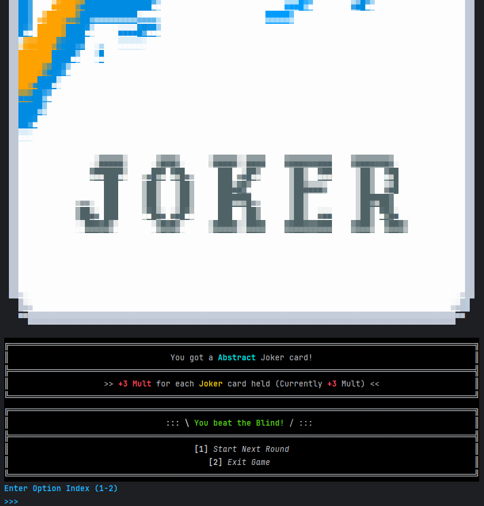

**Jokers** are special cards at the core of Javatro's gameplay. They possess _unique effects_ that can synergize, 
and a strong combination of jokers is typically essential for the player to defeat Blinds at higher Antes.

Instead of being included in Decks and played alongside standard cards, 
Jokers are held in the player's _5 dedicated joker slots_, and their effects will automatically be activated during gameplay.

#### Menu Options:
- `1. Start Next Round`
- `2. Exit Game`

_Enter `1` to proceed to the next round,
or `2` to end the current game session._

#### Joker Effects

| Joker      | Effect                                                                        |
|------------|-------------------------------------------------------------------------------|
| Greedy     | Played cards with ♦️ **Diamond** suit give _+3 Mult_ when scored              |
| Lusty      | Played cards with ♥️ **Heart** suit give _+3 Mult_ when scored                |
| Wrathful   | Played cards with ♠️ **Spade** suit give _+3 Mult_ when scored                |
| Gluttonous | Played cards with ♣️ **Club** suit give _+3 Mult_ when scored                 |
| Half       | _+20 Mult_ if played hand contains **3 or fewer** cards                       |
| Scary Face | Played **face** cards give _+30 Chips_ when scored                            |
| Abstract   | _+3 Mult_ for each **Joker** card                                             |
| Odd Todd   | Played cards with **odd rank** give _+31 Chips_ when scored _(A, 9, 7, 5, 3)_ |

---

### Winning the Game
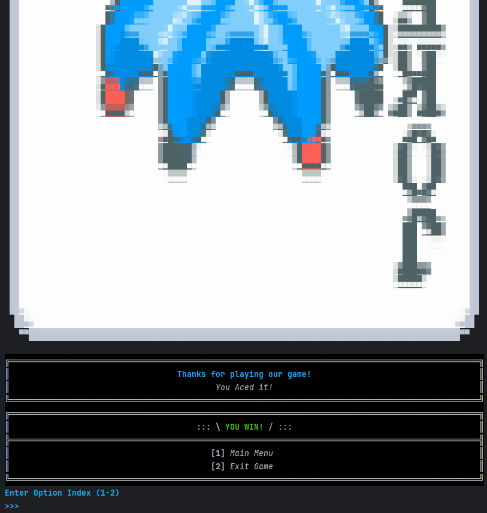

When _Ante 8_ is completed, the player **wins** the run, and is allowed to start a new one.  
_Victory Music will begin playing._

#### Menu Options:
- `1. Main Menu`
- `2. Exit Game`

_Enter `1` to return to the main menu,
or `2` to end the current game session._

---

### Losing the Game


If the player is unable to reach the blind's chip requirement in the allotted number of hands,
the run is **lost**, and the player must _restart_ from Ante 1.  
_Losing Sound Effect will begin playing._

#### Menu Options:
- `1. Main Menu`
- `2. Exit Game`

_Enter `1` to return to the main menu,
or `2` to end the current game session._

---

### Help Menu


#### Menu Options:
-`[1] Game Introduction`                               
-`[2] Game Rules`                                         
-`[3] How To Play`                                        
-`[4] Tips and Tricks`

_Enter `1` to learn more about Javatro as this section gives a brief overview of the game's objective, structure, 
and what makes it unique. Perfect for first-time players._
  

_Enter `2` to understand the core rules of the game._


_Enter `3` to understand a step-by-step breakdown of gameplay mechanics._
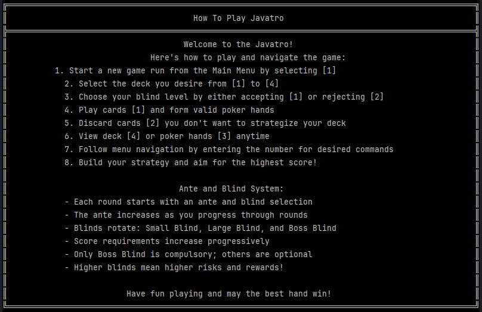

_Enter `4` to learn more about the helpful strategies and advice for surviving longer and building a stronger deck._
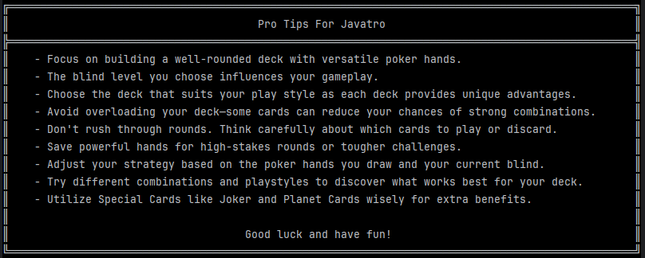

---

## Gameplay Flow

1. **Start Game**  
   Choose to _start_ a new game, or _continue_ a previous saved run.


2. **Select Deck**  
   Choose a deck from the available options.


3. **Select Blind**  
    Choose a blind _(Small, Large, or Boss)_ to determine the target score for the round.


4. **Play Hands**  
    - Choose to `Play Cards` or `Discard Cards` based on your dealt cards.
    - `View Poker Hands` or `View Deck` to strategize and evaluate your current hand.
    - Played cards are assessed, and points are awarded based on the hand formed.


5. **Score & Progress**  
    Accumulate points to meet or exceed the blind level to progress.


6. **Game End**  
   - **Win** by beating _Ante 8 Boss Blind_.
   - **Lose** by failing to meet the required score after using up all your hands.
   - You may _exit_ the game at any point within the game.
   - If you exit the game while a run is currently ongoing, your progress will be _saved_.

---

## FAQs

**Q: How do I view remaining hands/discards?**  
_A: The game screen shows `Hands: X` and `Discards: Y` in the status bar._

**Q: What happens if I run out of hands?**  
_A: The game ends if you fail to meet the target score before exhausting your hands._

**Q: Can I change decks mid-game?**  
_A: No, deck selection is permanent for each run. Start a new game to try different decks._

**Q: What if I enter an invalid command?**  
_A: Javatro displays an error message to help you correct your input._

**Q: How do i save my game progress?**  
_A: Your game progress is automatically saved whenever you finish a run or make significant progress._

**Q: Can I delete or overwrite saved runs?**  
_A: Currently, the game does not support deleting or overwriting saved runs._

**Q: Can I cheat or modify my saved data?**  
_A: Modifying the save file will corrupt the save data and reset your saves.

**Q: What happens if my save file gets corrupted?**  
_A: If the game detects a corrupted save file, it will attempt to create a new one and all your progress will be wiped_

**Q: I exited the game halfway right after making a move. What happens to my save?**  
_A: The save will be metastable. Doing this may most likely break your save, you have been warned..._

**Q: How do I enable or disable music in the game?**  
_A: Music is enabled by default when you start the game and cannot be disabled, it runs throughout the game._

**Q: What happens if I exit the game while music is playing?**  
_A: If you exit the game without stopping the music, the audio thread will be forcefully terminated. 
The next time you start the game, it will reinitialize the audio system and play the default music._

### How do I navigate through Javatro?

_Navigation throughout the application is done via **numbered options**. 
Selecting an option is done by entering the corresponding number._

```
1. New Game
2. Load Game
3. Exit
```

_For example, in the Main Menu, enter `1` and press `Enter` to start a new game._

---

## Known Issues

### Terminal Window Behavior

**Description:**  
**Javatro**’s UI relies on consistent terminal dimensions to render ANSI graphics and other elements correctly. Two specific scenarios can cause display issues:

1. **Resizing the Terminal Window During Execution:**  
   _Changing_ the terminal window size while the program is running can disrupt the UI layout and cause misalignment or incorrect rendering of output.

2. **Using a Small Terminal Window:**  
   If the terminal window is _not wide enough_, lines may wrap around, distorting the intended structure of ASCII elements and making the output hard to read.

**Recommended Solution:**  
To ensure proper UI rendering, players are advised to:
- Use a **fullscreen terminal window** before starting the program.
- **Avoid resizing** the terminal during program execution.
- Ensure the terminal is **wide enough** to accommodate full-line prints without wrapping.

Following these guidelines will help maintain the intended appearance and functionality of the **Javatro**’s UI.

### Exiting the Game Mid-Move

**Description:**  
Exiting the game immediately after making a move can corrupt the save file, 
resulting in inaccurate or invalid values within the storage system. 
When the game attempts to load the corrupted data, it may fail to function correctly or produce unintended behavior.

**Recommended Solution:**  
To prevent this issue, players should avoid closing the game abruptly during critical operations such as card plays or menu selections. 
Always allow the game to complete its saving process before exiting. 
If the issue persists, delete the corrupted save file and start a new game.

### Editing the Save File Manually

**Description:**  
Editing the save file (savefile.csv) directly will wipe all saved data. 
When the game starts, it generates a hash using the existing save data and compares it against the saved hash. 
Any modification to the save file will cause the hashes to mismatch, 
prompting the game to delete the save file and reset progress.

**Recommended Solution:**  
Avoid manually modifying the save file. If you need to transfer or backup save data, copy the entire file without altering its contents. 
If editing is necessary, ensure the hashes are recalculated using the same method as the game to prevent data loss.

---

## Glossary

**Ante**  
A stage of a run. Each run is divided into multiple antes (usually eight), 
with each ante consisting of several rounds ( 3 blinds per ante) that you must clear to progress. As the 
antes increase, the score to beat also progressively increases. 

**Blind**  
A round within an ante where you must score enough points (chips) to beat the challenge. There are three types:
- **Small Blind**: The first round; you can skip or play it.
- **Big Blind**: The second round; you can skip or play it.
- **Boss Blind**: The final round of an ante with a unique, often restrictive challenge. This round cannot be skipped.

**Chips**  
Points earned from playing a hand. 
Each hand’s chip value is calculated from the cards played and later multiplied by a multiplier.

**Multiplier**  
A factor that increases your hand’s chip score. 
Multipliers can be raised through various effects, most notably by equipping Joker cards and obtaining Planet Cards.

**Joker**  
Special cards that reside in your “Joker slots” (up to five by default) and grant passive effects. 
These effects may add chips, boost multipliers, or modify how hands are scored. 

**Playing Cards**  
The standard cards (initially a 52-card deck) that form the basis of every hand.

**Planet Cards**  
Upgrades specific poker hand types by increasing their base chip value and multiplier.

**Discard**  
A limited resource per round that lets you exchange unwanted cards from your hand. 
Managing discards is crucial for optimizing your hand.

**Hand Size**  
The number of cards drawn at the start of each round. It determines your options for forming poker hands.

**Hands**  
The number of times you can play cards during a round (similar to “lives”). 
If you run out of hands before meeting the blind’s score, the run ends.

**Run**  
A complete play session. A run ends when you fail an ante or successfully clear the final Boss Blind.

---

## Acknowledgements

- Javatro game concept is inspired by **Balatro**, a roguelike deck builder game developed by _LocalThunk_ and published by _Playstack_.
- **Javatro Music:** _Balatro - Complete Original Soundtrack (Official), Composed by LouisF._
- **Winning Music:** _We Are the Champions, Song by Queen - 1977._
- **Losing Sound Effect:** _[Cat Laughing At You](https://youtu.be/L8XbI9aJOXk?feature=shared)_

---

_**Note**: Screenshots show representative UI elements and may differ slightly in actual gameplay. 
All values reflect current game version v2.1._